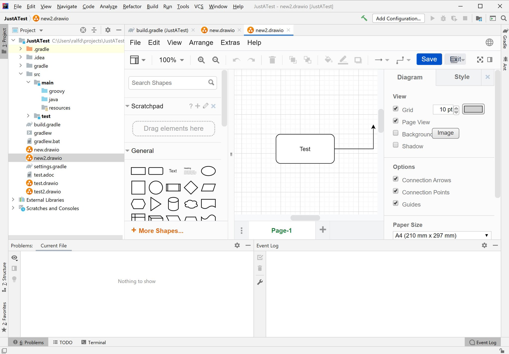

# Diagrams.net Integration for IntelliJ

<!-- Plugin description -->
This unofficial extension integrates [diagrams.net](https://app.diagrams.net/)  (formerly known as draw.io) directly into IntelliJ.
It supports diagram files with the extensions `.drawio.(svg|png|xml)` and `.dio.(svg|png|xml)`.
It also auto-detects editable PNGs and SVGs created with diagrams.net.

The editor uses an offline version of diagrams.net by default, therefore it works without an internet connection and content stays local in your IDE.
<!-- Plugin description end -->

## About

This plugin is still an early version and experimental.
If you like, you can help to evolve it.

## Installation

Releases are available on the [JetBrains Marketplace](https://plugins.jetbrains.com/plugin/15635-diagrams-net-integration). 
Use [Install plugin from repository](https://www.jetbrains.com/help/idea/managing-plugins.html#install_plugin_from_repo) to install them.

For pre-releases, either 
- download them from the [GitHub releases](https://github.com/docToolchain/diagrams.net-intellij-plugin/releases) and use [Install plugin from disk](https://www.jetbrains.com/help/idea/managing-plugins.html#install_plugin_from_disk) or 
- add the URL `https://plugins.jetbrains.com/plugins/eap/list?pluginId=15635` as a [custom plugin repository to your IDE](https://www.jetbrains.com/help/idea/managing-plugins.html#repos).

## References

* https://desk.draw.io/support/solutions/articles/16000042544-embed-mode
* https://github.com/jgraph/drawio-integration
* https://github.com/hediet/vscode-drawio

## Authors

## Docs

An architecture overview can be found at https://drawio-intellij-plugin.netlify.app/ .

## FAQ

### How do I build and run this project?

For development purpose, clone the project locally and start it with the command

`./gradlew runIde`

This will build the plugin and start an Instance of IntelliJ with the plugin already installed.
You can even start this in debug mode.

